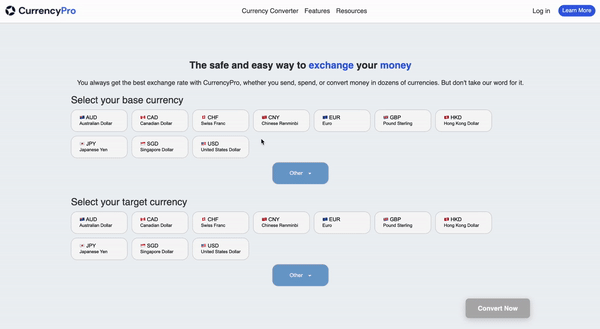
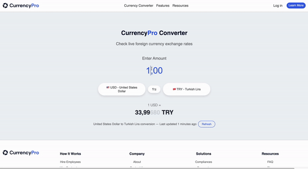
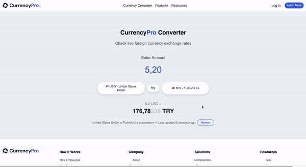

# CurrencyPro

CurrencyPro is a powerful and easy-to-use currency conversion web application that allows users to quickly and accurately convert amounts between different currencies. The application fetches live exchange rates from a reliable API and presents them with a clean, user-friendly interface.

## Table of Contents

- [Installation](#installation)
    - [Prerequisites](#prerequisites)
    - [Installing Node.js and Vite](#installing-nodejs-and-vite)
- [API Key Configuration](#api-key-configuration)
- [Running the Application](#running-the-application)
- [How to Use](#how-to-use)
- [Project Background](#project-background)
- [License](#license)

## Installation

### Prerequisites

Before you begin, ensure you have the following installed on your local machine:

- **Node.js** (v14.x or later)
- **Vite** (v2.x or later)

### Installing Node.js and Vite

If you don't have Node.js or Vite installed, follow the steps below to install them:

#### Installing Node.js

1. **Windows/Mac/Linux:**
    - Download the Node.js installer from [nodejs.org](https://nodejs.org/).
    - Run the installer and follow the on-screen instructions.
    - Verify the installation by running the following command in your terminal:
      ```bash
      node -v
      ```

#### Installing Vite

1. **Globally Install Vite** (if not already installed):
    - Open your terminal and run the following command:
      ```bash
      npm install -g create-vite
      ```
    - Verify the installation by running:
      ```bash
      npm create vite@latest
      ```

### Cloning the Repository

Once Node.js and Vite are installed, clone the repository to your local machine:

```bash
git clone https://github.com/muratlevent/CurrencyPro.git
cd currencypro
npm install
```

## API Key Configuration

CurrencyPro uses an exchange rate API to fetch live currency conversion rates. To use this feature, you'll need to configure your API key:

1. **Sign Up for an API Key**:
    - Register for a free API key at [ExchangeRate-API](https://www.exchangerate-api.com/).
    - You will receive an API key after registration.

2. **Set the API Key**:
    - Open `config.json` file in your project directory.
      ```json
      {
        "apiKey": "YOUR-API-KEY"
      }
      ```
    - Replace `YOUR-API-KEY` with your actual API key.

## Running the Application

To start the CurrencyPro application, follow these steps:

1. **Build the Application**:
    - Run the following command in your terminal:
      ```bash
      npm run build
      ```
    - This command will generate the build files in the `dist` folder.

2. **Preview the Application**:
    - To preview the application locally, use:
      ```bash
      npm run preview
      ```

3. **Run the Application**:
    - If you want to run the development server, use:
      ```bash
      npm run dev
      ```

## How to Use

CurrencyPro is designed for ease of use. Follow the steps below to use the application:

1. **Select Base and Target Currencies**:
    - Use the dropdowns to select your base currency and target currency. Then click on the `Convert Now` button.
   
        \
      


2. **Enter the Amount**:
    - Enter the amount you wish to convert in the input field.
   
      \
      
   

3. **Swap Currencies**:
    - Click on the `Swap` button to switch the base and target currencies.
   
      \
      
   
## Project Background

This project was built by following the project guide at the end of the [learnjavascript.online course](https://learnjavascript.online/projects/currency-pro.html). It serves as a practical application of JavaScript concepts, showcasing skills in API integration, event handling, and dynamic content rendering.

## License

This project is licensed under the MIT License. See the [LICENSE](LICENSE) file for more details.

---